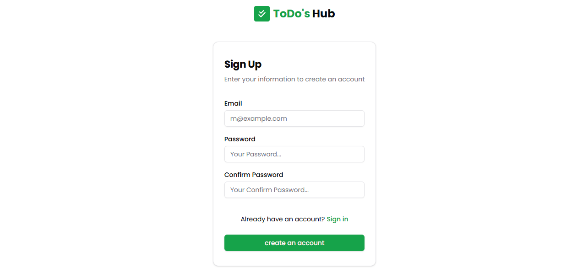
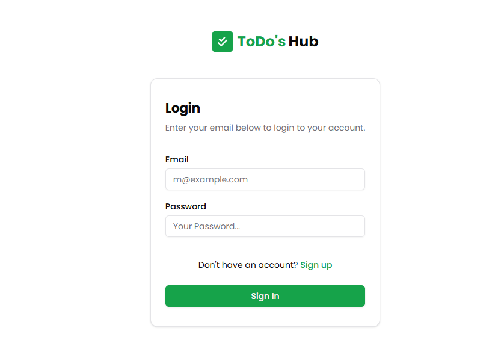
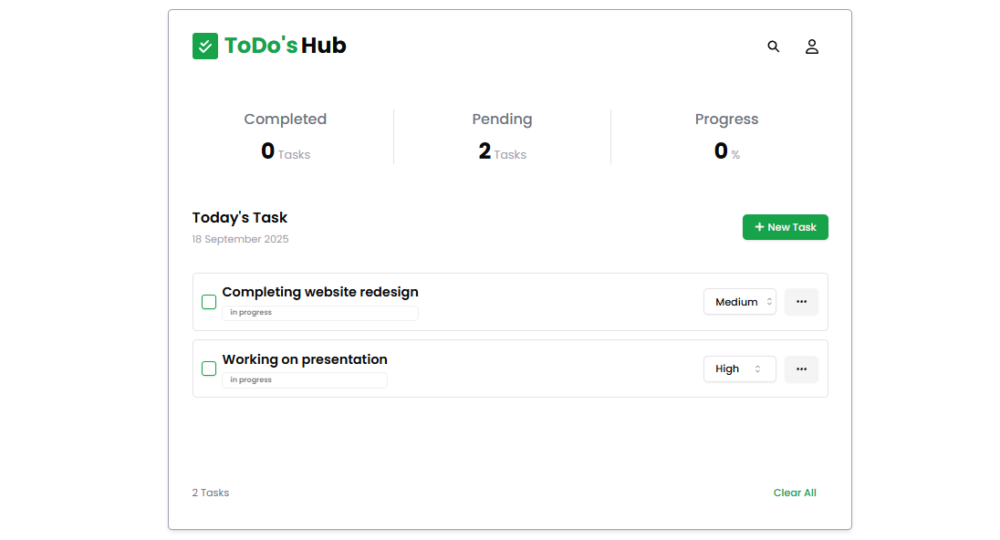

# ✅ ToDo's Hub

A modern and simple **Task Management App** built with **Next.js, Neon Serverless Postgres, Drizzle ORM, and Lucia Auth**.  
It allows users to **sign up, log in, manage tasks, and track progress** with full **CRUD operations** and **theme toggle (Light/Dark mode)**.  

---

## 🚀 Features

- 🔑 **Authentication**
  - Secure sign up & login with [Lucia Auth](https://lucia-auth.com/)
  - Passwords encrypted using **Argon2**
- 📝 **Task Management**
  - Create, Read, Update, Delete (CRUD) tasks
  - Set priorities (High, Medium, Low)
  - Change task status ( **In Progress**, **Completed**)
- 📊 **Progress Tracking**
  - Real-time progress % updates
  - Overview of **Completed** and **Pending** tasks
- 🎨 **Theme Support**
  - **Light/Dark mode** toggle using `next-themes`
- 🖥️ **Responsive UI**
  - Built with **Tailwind CSS** + **Radix UI components** for accessibility

---

## 📸 Screenshots

### 🔐 Sign Up  


### 🔑 Login  


### 📋 Dashboard (Tasks Overview)  


### ➕ Add Task  


### ✅ Updated Task List  


---

## 🛠️ Tech Stack

- **Framework**: [Next.js 14](https://nextjs.org/) (App Router)
- **Database**: [Neon Serverless Postgres](https://neon.tech/)
- **ORM**: [Drizzle ORM](https://orm.drizzle.team/)
- **Authentication**: [Lucia Auth](https://lucia-auth.com/) with Drizzle adapter
- **Password Hashing**: [Argon2](https://www.npmjs.com/package/argon2)
- **Styling**: [Tailwind CSS](https://tailwindcss.com/) + [Radix UI](https://www.radix-ui.com/) + [shadcn/ui](https://ui.shadcn.com/)
- **State Management**: [Zustand](https://zustand-demo.pmnd.rs/)
- **Form Handling**: [React Hook Form](https://react-hook-form.com/) + [Zod](https://zod.dev/)
- **Icons**: [Lucide React](https://lucide.dev/) & [React Icons](https://react-icons.github.io/react-icons/)

---

## ⚙️ Installation  

1.**Clone the Repository**  
   ```bash
   git clone https://github.com/Shambhavi2502/todo-hub
   cd todo's
   ```
2.**Install Dependencies**  
```bash
npm install
```
3.**Configure Environment Variables**  
Create a .env file in the root directory:  
```bash
DATABASE_URL="your_neon_postgres_connection_string"
```
4.**Run Database Migrations (Drizzle)**  
```bash
npm run db:generate
npm run db:push
```
5.**Start the Development Server**  
```bash
npm run dev
```
6.Open http://localhost:3000 in your browser.

----

## 🌐 Deployment  
ToDo's Hub is deployed on Vercel:  
👉 https://todo-hub-nine.vercel.app/  

---
